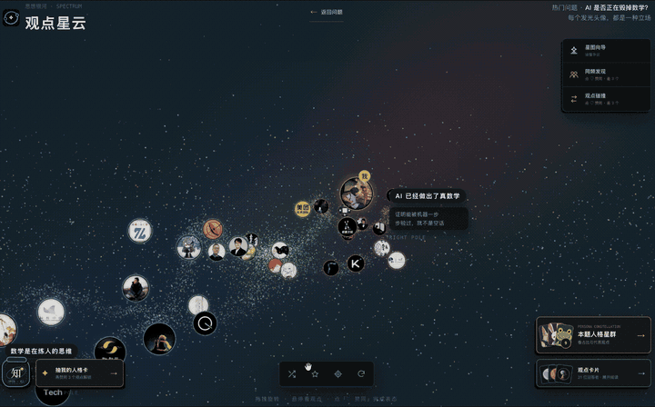
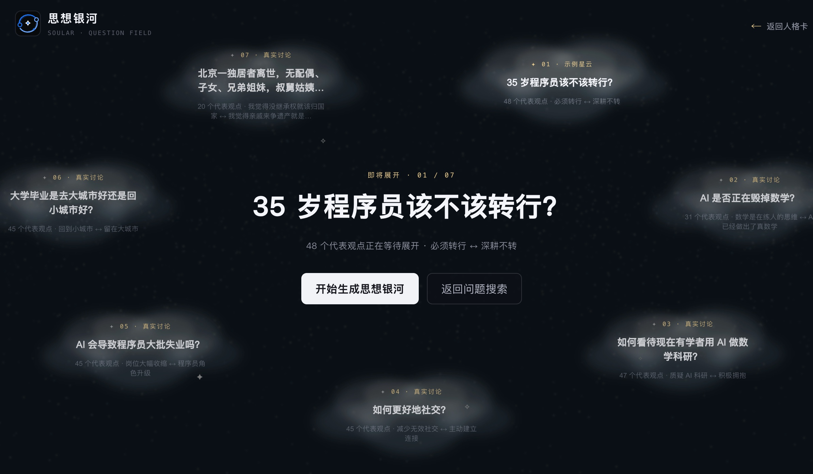
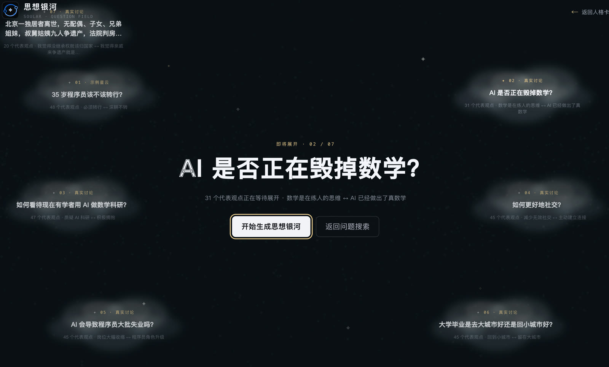
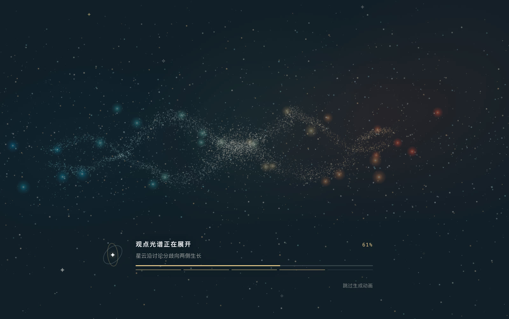
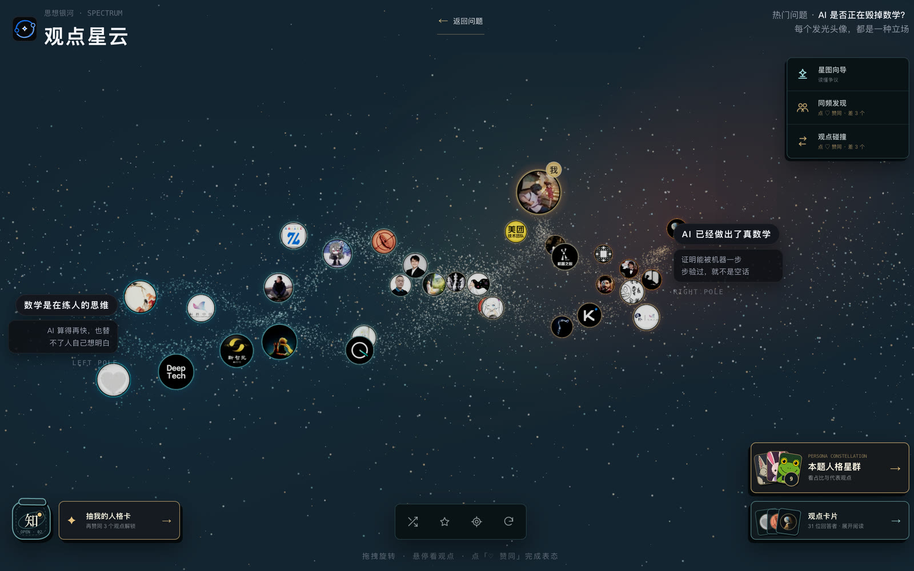
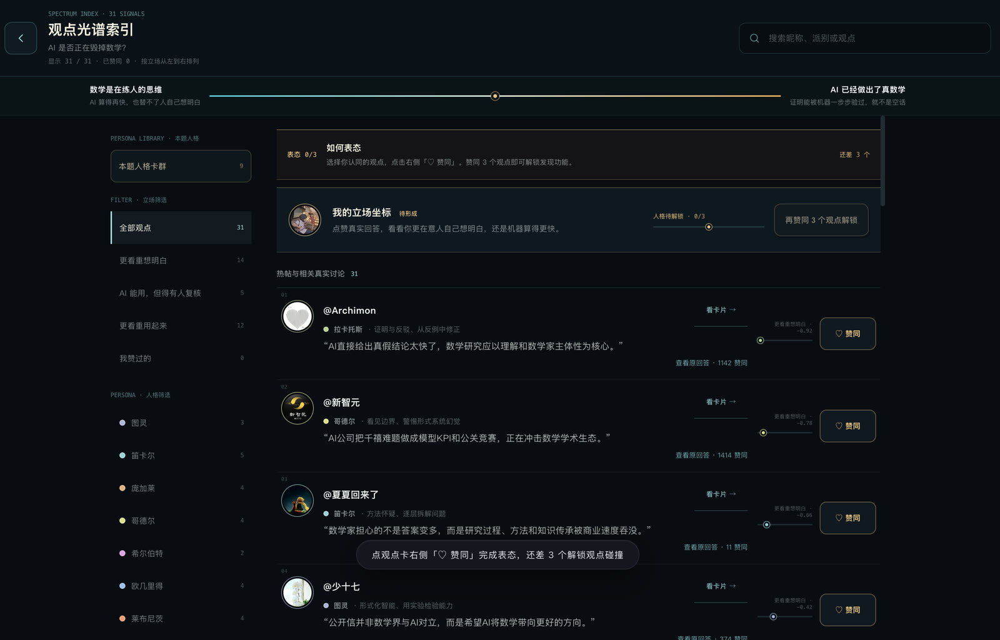
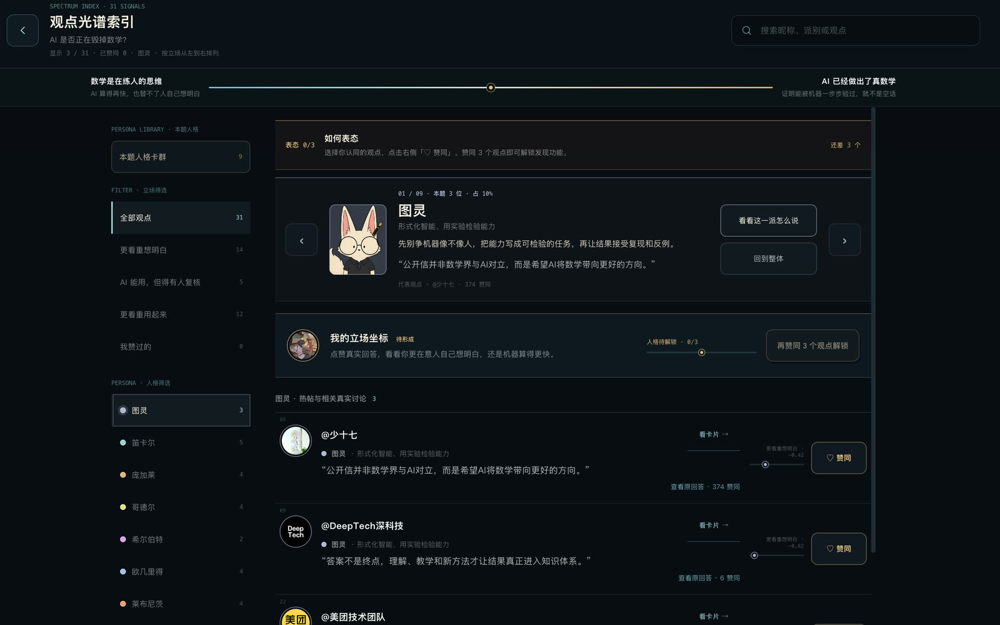
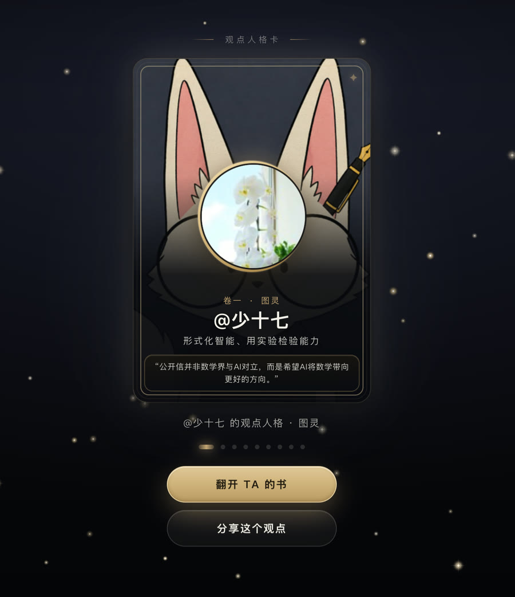
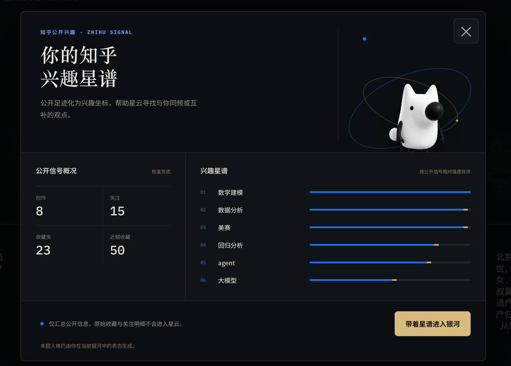

<h1 align="center">
  
</h1>

<p align="center"><strong>把一场讨论，变成一张可以漫游的观点地图。</strong></p>

<p align="center">
  每颗星对应一条真实回答，位置代表立场，距离呈现分歧。<br />
  沿着光谱阅读、表态和比较，找到自己在讨论中的坐标，也找到与你同频的人。
</p>

<p align="center">
  <a href="https://soular.top/"><strong>在线体验</strong></a> ·
  <a href="https://soular.top/nebula?preset=ai-math">探索真实热点</a> ·
  <a href="https://duang777.github.io/soular/">静态镜像</a> ·
  <a href="https://my.feishu.cn/wiki/WsfvwI271i19wSkOjz2cwQPlnOd">产品方案</a>
</p>

<p align="center"><code>React 19</code> · <code>TypeScript</code> · <code>Three.js</code> · <code>Cloudflare Workers</code></p>

<p align="center">
  
</p>

> 思想银河不替用户给结论。它把讨论的结构摊开，让观点、分歧和人与人的距离变得可见。

## 现在就能体验

| 入口 | 地址 | 可以看到什么 |
| --- | --- | --- |
| 正式站 | [soular.top](https://soular.top/) | 登录知乎后体验完整产品流程与兴趣星谱 |
| 真实热点星云 | [AI 是否正在毁掉数学？](https://soular.top/nebula?preset=ai-math) | 31 位真实回答者组成的观点光谱 |
| 静态镜像 | [GitHub Pages](https://duang777.github.io/soular/) | 引导前往正式站登录 |
| 开源仓库 | [Duang777/soular](https://github.com/Duang777/soular) | 源码、产品规格与开发文档 |

首页目前列出 7 个问题入口，包含 6 个真实讨论和 1 个示例问题，共 281 个观点坐标。

## 从一个问题出发

首页不是一张功能菜单，而是一排可以直接进入的讨论。选择问题后，先确认这次要探索的立场光谱，再用 8 秒生成动画把静态观点快照凝聚成星云。

<p align="center">
  
  <br />
  <sub>银河的故事：首页同时保留人格卡与问题入口</sub>
</p>

<table>
  <tr>
    <td width="50%" align="center">
      
      <br />
      <sub>确认问题与光谱两端</sub>
    </td>
    <td width="50%" align="center">
      
      <br />
      <sub>观点在 8 秒内凝聚成星云</sub>
    </td>
  </tr>
</table>

## 在星云里读一场讨论

回答者沿 `-1..1` 的立场光谱分布。拖拽和缩放可以观察全局，悬停星点能快速查看摘要，观点光谱索引则适合连续阅读、搜索和按人格筛选。真实回答保留知乎原文入口。

<p align="center">
  
  <br />
  <sub>3D 观点星云：头像、立场、星位和讨论结构同时可见</sub>
</p>

<table>
  <tr>
    <td width="50%" align="center">
      
      <br />
      <sub>按立场连续阅读真实观点</sub>
    </td>
    <td width="50%" align="center">
      
      <br />
      <sub>按主题人格查看分布与代表观点</sub>
    </td>
  </tr>
</table>

## 从表态到人格与关系

赞同 3 个观点后，系统会根据本题中的选择计算个人星位，并从对应主题的九位思想原型中生成观点人格。这里描述的是用户在当前问题中的表达倾向，不是对人的固定分类。

登录知乎后，兴趣星谱只汇总公开信号，用于辅助同频和互补匹配。原始创作、关注与收藏明细不会进入星云，也不会写入公开分享链接。

<table>
  <tr>
    <td width="38%" align="center">
      
      <br />
      <sub>可分享的观点人格卡</sub>
    </td>
    <td width="62%" align="center">
      
      <br />
      <sub>知乎公开信号形成兴趣星谱</sub>
    </td>
  </tr>
</table>

人格解锁后还可以：

- 每批发现最多 5 位同频回答者，并继续换一批。
- 在同频与互补之间切换，查看立场距离和兴趣交集。
- 聚焦当前问题中的小圈子，比较群体内部的共同点。
- 分享最多 6 道已完成问题，让朋友独立表态后生成共同思想地图。

## 为什么是银河

一个热门问题下可能有数十至数百条回答。纵向信息流适合逐篇阅读，却不容易看清整场讨论的形状：主要立场分布在哪里，彼此距离有多远，自己认同的人和相反观点的人分别是谁。

思想银河把回答放到连续光谱上。每个主题都有自己的左右两极和中间语义，中间立场、复杂观点和不确定性都可以保留下来。星云既是一张讨论地图，也是理解他人、定位自己和发现关系的入口。

## AI 负责提炼，人负责发布

公开星云都在发布前离线整理：

1. 从热门讨论和用户提名中选择主题。
2. AI 批量提炼立场、论点和光谱语义。
3. 人工检查原文链接、摘要、作者信息与立场。
4. 将通过验收的内容发布为静态快照。

网页运行时只读取已审核快照，不会在每次访问时重新调用知乎回答接口或生成整片星云。同一主题每次打开都保持稳定，上游服务暂时不可用时仍能继续浏览。

## 技术实现

| 层 | 技术 | 职责 |
| --- | --- | --- |
| 产品外壳 | React 19、React Router、TypeScript | 首页、路由、知乎账号状态、人格卡与共同思想地图 |
| 观点星云 | Three.js、原生 HTML/CSS/JavaScript | 3D 光谱、距离分级渲染、筛选、阅读与互动 |
| 内容快照 | 静态 ES Modules | 承载人工验收后的问题、回答者、立场和主题人格绑定 |
| 服务端 | Cloudflare Workers | 静态资源托管、OAuth、知乎开放平台访问与接口降级 |
| 状态与缓存 | Durable Objects、Cloudflare KV、浏览器本地存储 | 会话、公开画像缓存、点赞和标签页内导航上下文 |
| 内容生产 | Node.js 脚本、AI 批量标注、人工复核 | 离线采集、去重、质量检查与快照发布 |

React 外壳和 Three.js 场景通过受约束的 `postMessage` 协议通信。进入人格卡时保留原有星云实例，返回后无需重新初始化场景；远距离星点采用分级渲染，降低移动端和集成显卡的负担。

产品行为与验收状态见 [`spec.md`](./spec.md)，前后端接口边界见 [`docs/api-contract.md`](./docs/api-contract.md)。

## 本地运行

需要 Node.js 22+ 和 npm 10+：

```bash
git clone https://github.com/Duang777/soular.git
cd soular
npm ci
npm run dev
```

打开 <http://localhost:4325/>。真实热点星云可直接访问：

```text
http://localhost:4325/nebula?preset=ai-math
```

需要调试 Worker 时，再安装服务端依赖并启动本地服务：

```bash
npm --prefix server ci
npm run server:dev
```

<details>
<summary><strong>常用开发命令</strong></summary>

<br />

| 命令 | 用途 |
| --- | --- |
| `npm run dev` | 启动 Vite 开发服务器 |
| `npm run build` | 执行类型检查、前端契约检查并构建 |
| `npm run preview` | 本地预览生产构建 |
| `npm run check:navigation` | 检查星云、阅读流与人格卡导航 |
| `npm run check:share-match` | 检查朋友对照链接、参数和共同地图 |
| `npm run check:peer-discovery` | 检查同频发现、换一批与账号隔离 |
| `npm run check:personas` | 检查主题目录、九人格契约、素材和降级 |
| `npm run server:check` | 检查 Worker 类型、OAuth、安全边界与观点接口 |

</details>

## 代码结构

```text
.
├── src/                          # React 路由、应用外壳、人格卡与共同思想地图
├── public/
│   ├── persona-library.js        # 主题人格库、稳定槽位与素材记录
│   ├── brand/                    # Logo、站点图标与品牌资产
│   ├── nebula-scene/             # Three.js 星云、交互与静态快照
│   ├── personas/                 # 九派人格插画
│   ├── books/                    # 3D 人格书场景
│   └── kanshan/                  # 刘看山展示素材
├── server/                       # Cloudflare Worker、OAuth、缓存与接口
├── scripts/                      # 快照生产与契约检查
├── docs/
│   ├── images/                   # README 产品截图
│   ├── api-contract.md           # 前后端接口契约
│   └── persona-library.md        # 人物选择、扩展流程与授权边界
├── spec.md                       # 产品行为与验收状态
└── THIRD_PARTY_NOTICES.md        # 第三方代码与许可说明
```

## 发布新的观点主题

正式场景使用离线、可审查的快照，不在浏览器中直接调用知乎或 AI：

1. 从热门讨论或用户提名中选择主题，离线整理候选观点。
2. 人工检查立场、摘要、来源与图片授权，并补充作者展示信息。
3. 在 `public/nebula-scene/` 新增 `preset-<id>.js`，回答变化时同步更新内容版本。
4. 人格主题完成九位人物与素材验收后，在快照中填写 `personaTheme`；未完成时留空并使用经典九派。
5. 在 `public/nebula-scene/presets.js` 注册快照，并同步 `src/people.ts` 的版本目录。
6. 运行 `npm run build`，在桌面端与 390 px 移动端验证交互。

## 参与项目

欢迎通过 Issue 提交问题、产品建议和新主题提案，也欢迎提交范围清楚、可以复现和验证的 Pull Request。

- 不提交生成产物、密钥或本地状态。
- 涉及真实知乎内容时，保留可核验的来源链接并完成人工复核。
- 修改前端后运行 `npm run build`，接口与服务端改动再运行 `npm run server:check`。

## 数据与授权

- 网页运行时只读取已审核的观点快照。
- 点赞按快照版本保存在当前浏览器，不承诺跨设备同步。
- 知乎画像只作为兴趣底色，不改变用户在单个问题中的表态；原始创作、关注和收藏明细不会进入星云或分享链接。
- 朋友对照链接最多携带 6 组快照、人格和星位，不包含账号身份、点赞明细或知乎画像。接收方结果只保留在当前页面内存中，链接内容未经身份认证。
- 真实观点快照来自公开可访问的知乎内容，仓库只保留体验所需的摘要、来源和展示信息。
- 主题人物只作为当前问题的思想原型，不代表真实人格或人物背书；选择规则与素材清单见 [`docs/persona-library.md`](./docs/persona-library.md)。
- 第三方代码许可见 [`THIRD_PARTY_NOTICES.md`](./THIRD_PARTY_NOTICES.md)。
- 刘看山等赛事素材遵循主办方授权范围，仅限赛事期间使用，未经授权不得商用。

项目原创代码采用 [MIT License](./LICENSE) 开源。第三方代码、知乎内容、用户头像、刘看山及其他赛事素材不因此获得 MIT 授权，使用时须分别遵循其来源方条款。

## 关于项目

思想银河是 **知乎黑客松 2026 · 校园新锐季**“灵魂匹配局：社区连接与兴趣社交”赛道作品。

- [产品方案与原始创意](https://my.feishu.cn/wiki/WsfvwI271i19wSkOjz2cwQPlnOd)
- [赛事开发者手册](https://my.feishu.cn/docx/Mc80dR5XvoPaYDxcTasc04POnjd)
- [知乎开放平台](https://developer.zhihu.com/)

由 [Duang777](https://github.com/Duang777) 发起并维护。
