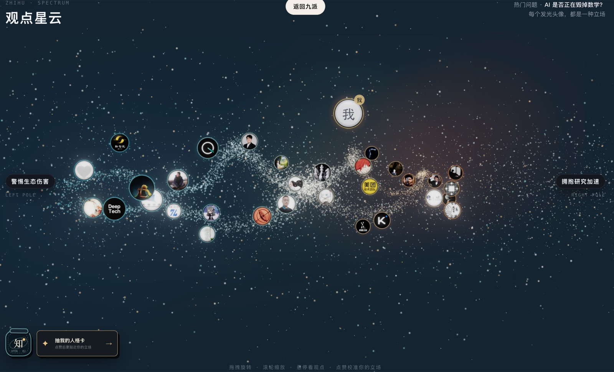
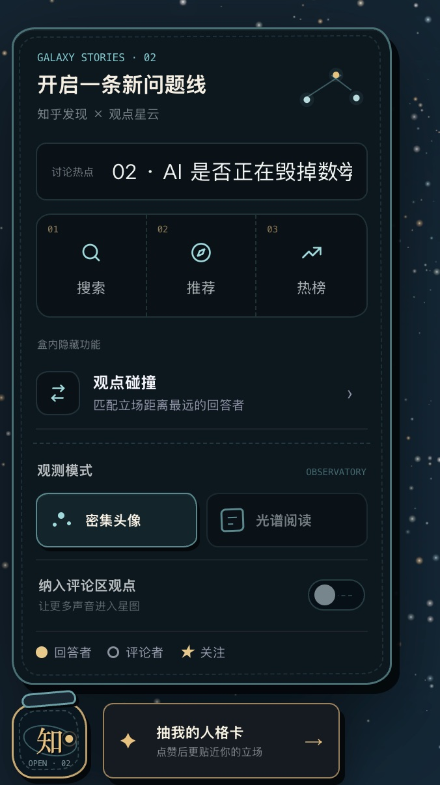
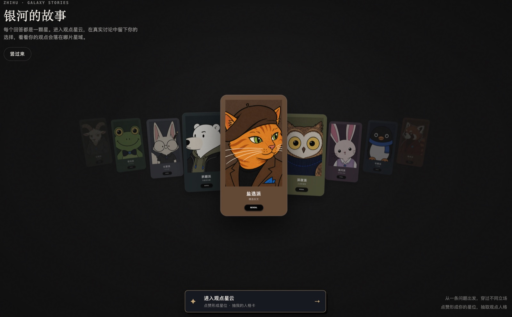

<h1 align="center">
  
</h1>

<p align="center"><strong>把一场讨论，变成一张可以漫游的观点地图。</strong></p>

<p align="center">
  每颗星对应一条真实回答，位置代表立场，距离呈现分歧。<br />
  沿着光谱阅读、点赞和比较，最后找到自己在讨论中的坐标。
</p>

<p align="center">
  <a href="https://soular.top/"><strong>soular.top</strong></a> ·
  <a href="https://soular.top/nebula?preset=ai-math">探索真实热点</a> ·
  <a href="https://duang777.github.io/zhihu-character-wave/">GitHub Pages</a> ·
  <a href="https://my.feishu.cn/wiki/WsfvwI271i19wSkOjz2cwQPlnOd">产品方案</a>
</p>

<p align="center"><code>React 19</code> · <code>TypeScript</code> · <code>Three.js</code> · <code>Cloudflare Workers</code></p>



> 思想银河不替用户给结论。它把讨论的结构摊开，让观点、分歧和人与人的距离变得可见。

## 现在就能体验

| 入口 | 地址 | 适合体验 |
| --- | --- | --- |
| 正式站 | [https://soular.top](https://soular.top/) | 完整产品流程 |
| 真实热点星云 | [AI 是否正在毁掉数学？](https://soular.top/nebula?preset=ai-math) | 31 位真实回答者与观点光谱 |
| 静态镜像 | [GitHub Pages](https://duang777.github.io/zhihu-character-wave/) | 无后端浏览 |
| 开源仓库 | [Duang777/zhihu-character-wave](https://github.com/Duang777/zhihu-character-wave) | 源码、文档与本地运行 |

## 一次完整体验

1. **进入讨论**：选择一场已经发布的热点星云，从全局看到立场如何分布。
2. **阅读观点**：悬停查看核心主张，筛选立场，按需回到知乎原文核验上下文。
3. **留下坐标**：点赞认可的回答，星位会随着选择实时移动。
4. **抽取人格**：把这次探索沉淀为观点人格卡和可交互的 3D 人格书。

<table>
  <tr>
    <td width="34%" align="center">
      
      <br />
      <sub>移动端观测站</sub>
    </td>
    <td width="66%" align="center">
      
      <br />
      <sub>九种观点人格组成的银河书架</sub>
    </td>
  </tr>
  <tr>
    <td width="34%" align="center">
      
      <br />
      <sub>可分享的观点人格卡</sub>
    </td>
    <td width="66%" align="center">
      
      <br />
      <sub>可交互的 3D 人格书</sub>
    </td>
  </tr>
</table>

## 为什么是银河

一个热门问题下可能有数百条回答。纵向信息流适合逐篇阅读，却很难看清整场讨论的形状：主要立场分布在哪里，彼此距离有多远，自己认同的人和相反观点的人分别是谁。

思想银河把回答放到 `-1..1` 的连续光谱上。每个主题都有自己的左右两极和中间语义，中间立场、复杂观点和不确定性都可以保留下来。星云既是一张讨论地图，也是用户理解他人、定位自己和发现关系的入口。

## AI 负责提炼，人负责发布

线上访问不会临时请求大模型生成星云。内容在发布前完成：

1. 服务端从知乎开放平台读取候选内容。
2. AI 批量提炼立场、论点和光谱语义。
3. 人工检查原文链接、摘要、作者信息与立场。
4. 将通过验收的数据作为静态快照随前端发布。

浏览器只读取已审核快照。这个流程把内容质量、访问速度和 API 配额分开处理，也避免同一主题每次打开时得到不同结果。

## 技术实现

| 模块 | 技术 | 职责 |
| --- | --- | --- |
| 产品外壳 | React 19、React Router、TypeScript | 路由、导航状态、书架和人格卡 |
| 观点星云 | Three.js、原生 HTML/CSS/JavaScript | 3D 光谱、筛选、阅读与互动 |
| 数据快照 | 静态 ES Modules | 承载人工验收后的问题、回答者和立场 |
| 服务端 | Cloudflare Workers、KV | OAuth、只读热榜、会话与缓存 |
| 发布 | Cloudflare 自定义域名、GitHub Pages | 正式站与静态镜像 |

前后端契约见 [`docs/api-contract.md`](./docs/api-contract.md)，产品行为和验收状态见 [`spec.md`](./spec.md)。

## 本地运行

需要 Node.js 22+ 和 npm 10+。静态快照与完整视觉体验不需要任何密钥：

```bash
git clone https://github.com/Duang777/zhihu-character-wave.git
cd zhihu-character-wave
npm ci
npm run dev
```

打开 <http://localhost:4325/>。真实热点快照可直接访问：

```text
http://localhost:4325/nebula?preset=ai-math
```

### 接入本地 API

```bash
npm --prefix server ci
cp server/.env.example server/.env
npm run server:dev
```

本地 API 默认运行在 <http://127.0.0.1:8787>，Vite 会将 `/api` 请求代理到该端口。没有知乎凭证时仍可预览静态体验，但 OAuth 和动态数据接口不可用。

敏感配置只能写入 `server/.env`、`server/.dev.vars` 或部署平台 Secret，禁止放入前端环境变量或提交到 Git。

<details>
<summary><strong>常用开发命令</strong></summary>

<br />

| 命令 | 用途 |
| --- | --- |
| `npm run dev` | 启动 Vite 开发服务器 |
| `npm run build` | 执行 TypeScript 检查并构建前端 |
| `npm run preview` | 本地预览生产构建 |
| `npm run check:navigation` | 检查星云与人格卡导航契约 |
| `npm run server:dev` | 启动本地 Node API |
| `npm run server:check` | 运行服务端类型、安全与离线光谱回归 |
| `npm run server:typecheck` | 检查服务端 TypeScript |
| `npm --prefix server run check:client-safety` | 检查缓存键、请求合并与限流策略 |
| `npm --prefix server run check:question-spectrum` | 检查离线观点光谱与公网路由边界 |
| `npm --prefix server run prepare:hot-spectrums -- --count=3 --answers=30` | 消耗真实配额，生成待人工验收的候选快照 |
| `npm --prefix server run cf:dev` | 启动本地 Cloudflare Worker |

</details>

## 代码结构

```text
.
├── src/                          # React 路由、应用外壳与人格卡
├── public/
│   ├── brand/                    # Logo、站点图标与品牌资产
│   ├── nebula-scene/             # Three.js 星云、交互与静态快照
│   ├── personas/                 # 九派人格插画
│   ├── books/                    # 3D 人格书场景
│   └── kanshan/                  # 刘看山展示素材
├── server/
│   ├── src/core/                 # 会话、缓存、画像、星图等领域逻辑
│   ├── src/zhihu/                # 知乎 OAuth 与 OpenAPI 客户端
│   ├── src/adapters/             # Node 与 Cloudflare KV 适配器
│   └── src/worker.ts             # Cloudflare Worker 入口
├── docs/
│   ├── api-contract.md           # 前后端契约与快照规范
│   └── images/                   # README 产品截图
└── THIRD_PARTY_NOTICES.md        # 第三方代码与许可说明
```

## 发布新的观点主题

正式场景使用离线、可审查的快照，不在浏览器中直接调用知乎或 AI：

1. 可选运行 `prepare:hot-spectrums` 生成 `.staging/hot-spectrums.json` 候选；该命令需要 `ZHIHU_ACCESS_SECRET`，并会消耗知乎与 AI 配额。
2. 人工检查候选的立场、摘要、来源与图片授权，并补充作者展示信息。
3. 在 `public/nebula-scene/` 新增 `preset-<id>.js`，填写内容版本、问题、光谱、讨论者、来源链接和可选头像；回答变化时必须更新版本。
4. 在 `public/nebula-scene/presets.js` 注册快照，并同步 `src/people.ts` 的版本目录。
5. 运行 `npm run build`，并在桌面端与 390 px 移动端验证交互。

快照字段和校验要求见 [`docs/api-contract.md#7-静态星云快照`](./docs/api-contract.md#7-静态星云快照)。

## 参与项目

欢迎通过 Issue 提交问题、产品建议和新主题提案，也欢迎提交聚焦、可验证的 Pull Request。

- 保持改动范围清晰，不提交 `dist/`、密钥或本地状态。
- 涉及真实知乎内容时，必须保留可核验的来源链接并进行人工复核。
- 修改前端后运行 `npm run build`；修改服务端后运行 `npm run server:check`。
- 修改路由、字段、缓存或认证边界时，同步更新 `docs/api-contract.md`。

## 数据与授权

- 浏览器端不会持有知乎 Access Secret、OAuth App Key、OAuth Token 或原始会话数据。
- 点赞按快照版本保存在浏览器本地，不写入 OAuth Session，也不承诺跨设备同步。
- 真实观点快照来自公开可访问的知乎内容，仓库仅保留体验所需的摘要、来源和展示信息。
- 第三方代码许可见 [`THIRD_PARTY_NOTICES.md`](./THIRD_PARTY_NOTICES.md)。
- 刘看山等赛事素材遵循主办方授权范围，仅限赛事期间使用，未经授权不得商用。

项目原创代码采用 [MIT License](./LICENSE) 开源。第三方代码、知乎内容、用户头像、刘看山及其他赛事素材不因此获得 MIT 授权，使用时须分别遵循其来源方条款。

## 关于项目

思想银河是 **知乎黑客松 2026 · 校园新锐季**“灵魂匹配局：社区连接与兴趣社交”赛道作品。

- [产品方案与原始创意](https://my.feishu.cn/wiki/WsfvwI271i19wSkOjz2cwQPlnOd)
- [赛事开发者手册](https://my.feishu.cn/docx/Mc80dR5XvoPaYDxcTasc04POnjd)
- [知乎开放平台](https://developer.zhihu.com/)

由 [Duang777](https://github.com/Duang777) 发起并维护。
