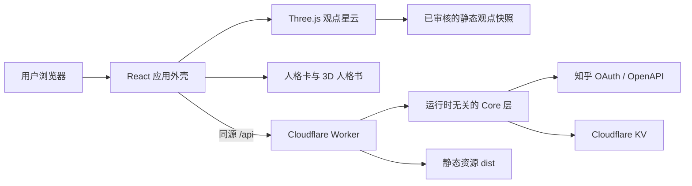

<h1 align="center">
  
</h1>

<p align="center"><strong>把几百条回答，变成一张可以漫游的观点地图。</strong></p>

<p align="center">
  AI 提炼真实讨论中的立场与核心论点，让每个回答成为一颗星；<br />
  你在阅读和点赞中留下自己的坐标，并获得一张独特的观点人格卡。
</p>

<p align="center">
  <a href="https://soular.top/">在线体验</a> ·
  <a href="https://soular.top/nebula?preset=ai-math">进入观点星云</a> ·
  <a href="https://duang777.github.io/zhihu-character-wave/">静态镜像</a> ·
  <a href="https://my.feishu.cn/wiki/WsfvwI271i19wSkOjz2cwQPlnOd">产品方案</a>
</p>

<p align="center"><strong>React 19 · TypeScript · Three.js · Cloudflare Workers · KV · 知乎开放平台</strong></p>


> 每个发光头像，都是一种立场。<br />
> 思想银河不是替用户给出结论，而是帮助用户看见讨论全貌、理解差异，并找到自己在其中的位置。

<table>
  <tr>
    <td width="34%" align="center">
      
      <br />
      <sub>移动端观测站：切换问题、模式和评论观点</sub>
    </td>
    <td width="66%" align="center">
      
      <br />
      <sub>银河书架：九种知乎内容人格</sub>
    </td>
  </tr>
  <tr>
    <td width="34%" align="center">
      
      <br />
      <sub>可分享的观点人格卡</sub>
    </td>
    <td width="66%" align="center">
      
      <br />
      <sub>可交互的 3D 人格书</sub>
    </td>
  </tr>
</table>

## 为什么做思想银河

一个热门问题下可能有数百条回答。传统的纵向信息流适合逐篇阅读，却很难回答三个更宏观的问题：

- 这场讨论里有哪些主要立场，它们如何分布？
- 我关注的人、我认同的人和相反观点的人分别在哪里？
- 看完这些内容后，我自己的立场发生了什么变化？

思想银河用 AI 对回答进行观点提炼和立场映射，再通过可旋转的 3D 星云呈现讨论结构。用户可以从全局分布进入具体回答，也可以通过点赞形成自己的“星位”，最终抽取对应的观点人格。

## 核心体验

1. **看见讨论全貌**：动态生成观点光谱两端，将回答者映射到连续立场坐标，而不是简单二选一。
2. **探索真实观点**：悬停查看核心主张，按立场筛选或搜索，并跳转到知乎原始内容核验上下文。
3. **发现人与关系**：突出关注对象、评论者和潜在观点圈层，也可以主动寻找距离最远的观点。
4. **形成个人星位**：点赞会持续更新用户在光谱中的位置，而不是一次性的静态测试结果。
5. **抽取观点人格**：九种知乎内容人格将立场探索延伸为可分享的人格卡和 3D 人格书。

## 产品设计

### 观点不是标签，而是坐标

每个主题都根据实际回答生成自己的左右两极和中间语义。回答以 `-1..1` 的连续值分布，保留中间立场、复杂观点和不确定性。

### AI 负责提炼，人负责验收

线上访问不会临时请求大模型生成星云。当前流程是：

1. 服务端从知乎开放平台读取候选内容。
2. AI 批量提炼立场、论点和光谱语义。
3. 人工检查原文链接、摘要、作者信息与立场。
4. 将通过验收的数据作为静态快照随前端发布。

这种方式兼顾了信息质量、访问速度、接口配额和故障可用性，也避免模型结果在每次访问时发生漂移。

### 从内容理解走向社交发现

星云不仅展示“大家怎么想”，还支持观察关注对象、评论声音、观点圈层和对立立场。人格卡则把一次讨论中的行为转化为轻量、可传播的个人表达。

## 系统架构



- **前端外壳**：React 19、React Router、TypeScript，负责路由、持久导航状态和人格卡流程。
- **视觉场景**：原生 HTML/CSS/JavaScript 与本地 Three.js 模块，通过受控 `postMessage` 协议嵌入 React。
- **服务端**：Node.js 22 TypeScript，核心逻辑基于 Web Platform API，同时运行于本地 Node 适配器和 Cloudflare Worker。
- **数据层**：知乎 OAuth、知乎开放平台、KV 会话与缓存；服务端没有运行时 npm 依赖。
- **部署**：Cloudflare Worker 同域托管前端资源和 `/api/*`，GitHub Pages 提供无需后端的静态镜像。

更多接口与缓存约定见 [`docs/api-contract.md`](./docs/api-contract.md)。

## 快速开始

### 环境要求

- Node.js 22+
- npm 10+

### 运行前端

静态快照和完整视觉体验不需要任何密钥：

```bash
git clone https://github.com/Duang777/zhihu-character-wave.git
cd zhihu-character-wave
npm ci
npm run dev
```

打开 <http://localhost:4325/>。真实热点快照可直接访问：

```text
http://localhost:4325/nebula?preset=ai-math
```

### 可选：运行本地 API

```bash
npm --prefix server ci
cp server/.env.example server/.env
npm run server:dev
```

本地 API 默认运行在 <http://127.0.0.1:8787>，Vite 会将 `/api` 请求代理到该端口。没有知乎凭证时仍可预览静态体验，但 OAuth 和动态数据接口不可用。

敏感配置只能写入 `server/.env`、`server/.dev.vars` 或部署平台 Secret，禁止放入前端环境变量或提交到 Git。

## 常用命令

| 命令 | 用途 |
| --- | --- |
| `npm run dev` | 启动 Vite 开发服务器 |
| `npm run build` | 执行 TypeScript 检查并构建前端 |
| `npm run preview` | 本地预览生产构建 |
| `npm run check:navigation` | 检查星云与人格卡导航契约 |
| `npm run server:dev` | 启动本地 Node API |
| `npm run server:check` | 运行服务端类型、安全与离线光谱回归 |
| `npm run server:typecheck` | 检查服务端 TypeScript |
| `npm --prefix server run check:client-safety` | 检查缓存键、请求合并与限流策略 |
| `npm --prefix server run check:question-spectrum` | 检查离线观点光谱与公网路由边界 |
| `npm --prefix server run prepare:hot-spectrums -- --count=3 --answers=30` | 消耗真实配额，生成待人工验收的候选快照 |
| `npm --prefix server run cf:dev` | 启动本地 Cloudflare Worker |

## 项目结构

```text
.
├── src/                          # React 路由、应用外壳与人格卡
├── public/
│   ├── brand/                    # Logo、站点图标与品牌资产
│   ├── nebula-scene/             # Three.js 星云、交互与静态快照
│   ├── personas/                 # 九派人格插画
│   ├── books/                    # 3D 人格书场景
│   └── kanshan/                  # 刘看山展示素材
├── server/
│   ├── src/core/                 # 会话、缓存、画像、星图等领域逻辑
│   ├── src/zhihu/                # 知乎 OAuth 与 OpenAPI 客户端
│   ├── src/adapters/             # Node 与 Cloudflare KV 适配器
│   └── src/worker.ts             # Cloudflare Worker 入口
├── docs/
│   ├── api-contract.md           # 前后端契约与快照规范
│   └── images/                   # README 产品截图
└── THIRD_PARTY_NOTICES.md        # 第三方代码与许可说明
```

## 添加新的观点主题

正式场景使用离线、可审查的快照，不在浏览器中直接调用知乎或 AI：

1. 可选运行 `prepare:hot-spectrums` 生成 `.staging/hot-spectrums.json` 候选；该命令需要 `ZHIHU_ACCESS_SECRET`，并会消耗知乎与 AI 配额。
2. 人工检查候选的立场、摘要、来源与图片授权，并补充作者展示信息。
3. 在 `public/nebula-scene/` 新增 `preset-<id>.js`，填写内容版本、问题、光谱、讨论者、来源链接和可选头像；回答变化时必须更新版本。
4. 在 `public/nebula-scene/presets.js` 注册快照，并同步 `src/people.ts` 的版本目录。
5. 运行 `npm run build`，并在桌面端与 390 px 移动端验证交互。

快照字段和校验要求见 [`docs/api-contract.md#7-静态星云快照`](./docs/api-contract.md#7-静态星云快照)。

## 参与贡献

欢迎通过 Issue 提交问题、产品建议和新主题提案，也欢迎提交聚焦、可验证的 Pull Request。

- 保持改动范围清晰，不提交 `dist/`、密钥或本地状态。
- 涉及真实知乎内容时，必须保留可核验的来源链接并进行人工复核。
- 修改前端后运行 `npm run build`；修改服务端后运行 `npm run server:check`。
- 修改路由、字段、缓存或认证边界时，同步更新 `docs/api-contract.md`。

## 数据、安全与授权

- 浏览器端不会持有知乎 Access Secret、OAuth App Key、OAuth Token 或原始会话数据。
- 点赞按快照版本保存在浏览器本地，不写入 OAuth Session，也不承诺跨设备同步。
- 真实观点快照来自公开可访问的知乎内容，仓库仅保留体验所需的摘要、来源和展示信息。
- 第三方代码许可见 [`THIRD_PARTY_NOTICES.md`](./THIRD_PARTY_NOTICES.md)。
- 刘看山等赛事素材遵循主办方授权范围，仅限赛事期间使用，未经授权不得商用。

项目原创代码采用 [MIT License](./LICENSE) 开源。第三方代码、知乎内容、用户头像、刘看山及其他赛事素材不因此获得 MIT 授权，使用时须分别遵循其来源方条款。

## 项目背景

思想银河是 **知乎黑客松 2026 · 校园新锐季**“灵魂匹配局：社区连接与兴趣社交”赛道作品。

- [产品方案与原始创意](https://my.feishu.cn/wiki/WsfvwI271i19wSkOjz2cwQPlnOd)
- [赛事开发者手册](https://my.feishu.cn/docx/Mc80dR5XvoPaYDxcTasc04POnjd)
- [知乎开放平台](https://developer.zhihu.com/)
